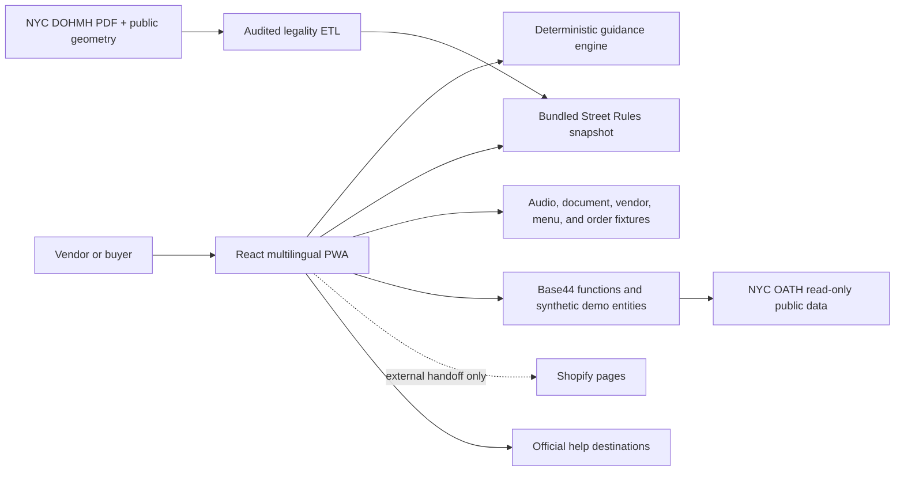

<p align="center">
  
</p>

<p align="center">
  <strong>Multilingual guidance, street-rule context, and a safer path to selling for NYC street vendors.</strong>
</p>

<p align="center">
  <code>Hackathon proof of concept</code> · <code>Fictional demo data</code> · <code>Seven languages</code> · <code>Base44 + React</code>
</p>

> [!IMPORTANT]
> SIDEWALK is a prototype. It is not affiliated with or endorsed by NYC, is not legal advice, and does not issue licenses, file applications, send messages, move money, or decide where someone may vend. Use only the bundled fictional demo materials; never enter real personal, legal, financial, immigration, or confidential information.

## What is SIDEWALK?

SIDEWALK is an AI-assisted navigation and preparation layer for New York City street vendors. It helps a vendor turn a confusing requirement, frightening notice, or location question into a source-linked next step and an organized record in the vendor's language. A two-sided marketplace shell lets judges explore the same prototype from buyer and seller perspectives without creating a real identity or completing a real transaction.

The central fictional persona is Rosa, a Spanish-speaking mobile food vendor. The wider marketplace contains only invented vendors, menus, locations, prices, notices, sales, and orders.

SIDEWALK stays deliberately narrow about authority: it can report what a cited source says and help someone prepare, but NYC agencies and qualified service providers retain every licensing, permitting, filing, hearing, placement, and eligibility decision.

## Product tour

### Vendor experience

- Create a local-first fictional vendor account without a real name, phone number, or payment credential.
- Use **Ask**, **Check**, and **My Sales** inside the embedded Get Verified experience.
- Ask a preparation question by voice or text and receive deterministic, source-labeled guidance.
- Upload the bundled fabricated summons, confirm the extracted ticket number, and run a read-only NYC OATH lookup.
- Record a confirmed `$12` cash sale separately from a visibly simulated card event.
- Open **Street Rules** as a map or keyboard-accessible list and inspect what a bundled NYC restricted-streets snapshot says about a selected block at the current New York wall-clock time.
- Choose **No or I'm not sure** to review multilingual preparation and official-help resources.
- Use the seller storefront screens as a fixture-backed concept demo; no working Shopify connection is claimed.

### Buyer experience

- Explore 15 fictional vendors and 46 fictional menu items across the five boroughs.
- Select a vendor to view its menu and a report about nearby entries in the bundled restricted-streets list.
- Add sample items to a session-only order and view the total in the Orders workspace; the state is capped, never persisted, and never transmitted.
- Explicitly open Rosa's fictional sample storefront and local test-cart experience.
- See provenance labels that distinguish live public data, live AI, bundled public snapshots, fixtures, simulations, and unavailable results.

The repository also includes an [under-80-second judge script](JUDGE_DEMO_80_SECONDS.md). Update its cues whenever the primary demo path changes.

## Marketplace workspaces

| Role | Available workspaces |
|---|---|
| Buyer | Explore, Store, Street Rules, Orders, Account |
| Vendor | Dashboard, Online Store, Street Rules, Orders, Get Verified, Account |

The public app does not expose the legacy internal console or proof views. Those components remain in the source for trace-oriented development, but embedded marketplace navigation disables them.

## Seven-language support

The marketplace and preparation surfaces use statically bundled catalogs. Arabic is rendered right-to-left, and the app bundles Noto font families for the included scripts.

| Language | Locale | Prototype voice behavior |
|---|---:|---|
| English | `en` | Validated device speech plus sample audio |
| Spanish | `es` | Validated device speech plus sample audio |
| Wolof | `wo` | Fixture-first sample audio |
| Arabic | `ar` | RTL text; Egyptian-Arabic sample voice |
| Bangla | `bn` | Fixture-first sample audio |
| Simplified Chinese | `zh-Hans` | Mandarin sample voice |
| French | `fr` | Fixture-first sample audio |

Typed input remains available when speech is unsupported or unavailable. Legal and safety guidance never silently falls back into a different language.

## Integration truth table

Every provider result carries provenance, and the UI derives its status badge from that metadata.

| Capability | Prototype behavior |
|---|---|
| Preparation guidance | Deterministic demo rulebook with fixed localized templates |
| Speech and ticket extraction | Base44 AI when configured; exact-hash fixture fallback only |
| NYC summons records | Live, read-only NYC OATH public-data lookup |
| Public-data failure | Explicitly unavailable; sample data requires a separate user action |
| Street Rules | Bundled public snapshot derived from a NYC DOHMH guide and NYC street geometry |
| Sample vendors and menus | Fictional committed seed data |
| Cash sales | Confirmed, self-reported demo evidence |
| Card sales, cart, and orders | Fixture or session-only simulation; no payment SDK |
| Shopify | Experimental external handoffs and backend scaffolding; no working end-to-end integration is claimed |
| Referrals and outreach | Local handoff preview only; nothing is sent automatically |
| Accounts and sessions | Local-first synthetic state with best-effort Base44 sync, not production authentication |

Some presentation controls open an external Shopify page in a new tab. SIDEWALK does not create a charge or payment inside the app, but the external page is outside this prototype's control. Do not enter real payment or identity information and do not complete a real transaction during the demo.

## Street Rules: report, not permission

The Street Rules workspace uses a committed snapshot of the NYC Department of Health and Mental Hygiene **Mobile Food Vending Restricted Streets Guide**, revision `EHS334503E – 4.23`. Its build pipeline parses the source PDF, matches printed street names to NYC Street Centerline data, derives approximate block geometry, and bundles all five borough outlines. Reports use the current New York wall clock and a closed status vocabulary: restricted now, restricted later today, no restricted hours listed today, out of season, or unknown.

The current snapshot contains 190 printed rows represented by 172 polylines, 11 approximate corridors, and 7 approximate pins, with no currently unmatched rows. It is intentionally conservative:

- It covers **mobile food vending only**. It excludes the separate general-vendor list, Green Cart areas, parks and concessions, sidewalk-obstruction rules, and private property.
- Street centerline geometry is approximate and cannot determine which side of a street the user occupies.
- Point reports use approximate distance bands—within 25 meters for a listed block and within 120 meters for a nearby block—and return at most five matches.
- A place not appearing in this snapshot is **not** a finding that vending is allowed there.
- Permits, parks, private property, sidewalk clearance, doorways, bus stops, schools, and other rules are outside this dataset.
- Unknown or unparseable schedule data remains unknown; the engine never guesses a permissive answer.

The map can request OpenStreetMap raster tiles when a network is available; those requests expose ordinary network metadata to the tile provider. The bundled borough outlines, restricted-street geometry, report engine, and list provide a network-free fallback.

The ETL and its audit artifacts live under [`scripts/legality/`](scripts/legality/README.md). Regenerating the snapshot is a maintainer task, not part of normal app startup:

```bash
# Requires Deno and pdftotext from Poppler
npm run data:legality

# Force a fresh source fetch instead of using the ignored local cache
npm run data:legality -- --refresh
```

The pipeline fetches the DOHMH PDF, NYC Street Centerline dataset `inkn-q76z`, and borough-boundary dataset `gthc-hcne`; it uses exact aliases rather than fuzzy matching and aborts instead of emitting a partial artifact. Snapshot timestamps identify artifact generation. Use `--refresh` when the audit must prove a new network fetch.

## Official-help destinations

SIDEWALK can prepare a local handoff summary and route a user to first-party pages. It never submits a form or contacts an organization on the user's behalf.

- [NYC Office of Street Vendor Services](https://nyc-business.nyc.gov/nycbusiness/business-services/initiatives/street-vending-in-nyc)
- [NYC OATH Help Center](https://www.nyc.gov/site/oath/help-center/help-center.page)
- [Street Vendor Project legal assistance](https://www.streetvendor.org/legal-assistance)
- [NYC Health Department permits and licenses](https://www.nyc.gov/site/doh/business/permits-licenses.page)
- [NYC DCWP General Vendor license checklist](https://www.nyc.gov/site/dca/businesses/license-checklist-general-vendor.page)

## Architecture



### Main technologies

- React 18 and Vite 6
- Base44 SDK, Vite plugin, entities, and Deno backend functions
- `i18next` and `react-i18next` with statically bundled catalogs
- Leaflet with optional OpenStreetMap tiles and a bundled vector/list fallback
- Zod schemas for strict backend boundaries
- Vitest for deterministic, localization, data, and integration contracts
- Playwright for network-free mobile and desktop judge journeys
- Locally bundled Noto Sans font families

### Repository layout

```text
base44/
  config.jsonc          Base44 site configuration
  entities/             Synthetic demo schemas
  functions/            Deno backend functions
  shared/               Deterministic guidance and provider contracts
public/
  audio/                 Seven-language sample audio
  shopify-fixtures/      Fictional menu and cart artwork
scripts/
  legality/              Restricted-streets ETL, reports, and audit notes
src/
  components/            Marketplace, Street Rules, preparation, and store UI
  data/                  Fictional vendors and bundled public snapshots
  i18n/                  Locale registry and translation catalogs
  lib/                   Account, legality, routing, provenance, and fixture logic
  pages/                 Marketplace and embedded SIDEWALK surfaces
tests/
  unit/                  Determinism, localization, data, safety, and boundaries
  e2e/                   Network-free mobile and desktop journeys
```

## Run locally

### Prerequisites

- Node.js and npm
- Chromium for the Playwright browser suite
- A Base44 account only when running or deploying hosted Base44 resources

### Frontend development

```bash
git clone https://github.com/yogendrarau/Sidewalk.git
cd Sidewalk
git checkout base-44-generation
npm install
npm run dev
```

For frontend-only work against the hosted Base44 app, create an uncommitted `.env.local`:

```dotenv
VITE_BASE44_APP_ID=6a807abba4a26b462c198c81
VITE_BASE44_APP_BASE_URL=https://your-published-base44-app-url
# Optional when testing a specific deployed function version:
VITE_BASE44_FUNCTIONS_VERSION=
```

`NYC_OPEN_DATA_APP_TOKEN` is an optional **server-side** secret for Socrata rate-limit relief. Never expose it—or any other secret—through a `VITE_*` variable. No Shopify credential is required for the honest fixture-based judge path.

Never commit `.env.local`, access tokens, personal data, or vendor documents.

### Full Base44 development

The project already contains `base44/config.jsonc`. Maintainers can authenticate and run the configured frontend and local Base44 resources together:

```bash
npx base44 login
npx base44 dev
```

A GitHub push does **not** deploy the Base44 app. After reviewing the diff and passing preflight, an authenticated maintainer can deploy the configured site and resources with the Base44 CLI:

```bash
npm run preflight
npx base44 deploy -y
```

- Base44 app ID: `6a807abba4a26b462c198c81`
- Active development branch: [`base-44-generation`](https://github.com/yogendrarau/Sidewalk/tree/base-44-generation)

## Quality checks

```bash
# Lint, type-check, unit tests, and production build
npm run preflight

# Network-free unit suite
npm run test:unit

# Install Chromium once, then run mobile and desktop journeys
npx playwright install chromium
npm run test:e2e
```

An opt-in rehearsal can exercise the real read-only OATH path against a deployed fictional session:

```bash
LIVE_BASE_URL=https://your-deployed-app.example \
LIVE_DEMO_SESSION_ID=YOUR_FICTIONAL_SESSION \
npm run test:e2e:live
```

Device microphone and speech behavior remain a manual venue-device rehearsal; headless browser tests do not pretend to validate them.

## Safety and privacy boundaries

### Demonstrated in this prototype

- Fictional personas, notices, businesses, locations, sales, menus, and orders
- Explicit confirmation before recording cash evidence or self-attesting
- Source and timestamp display for public-data and bundled-snapshot results
- Provenance badges with no silent live-to-fixture fallback
- A fail-toward-unknown Street Rules engine
- No immigration-status field
- No payment SDK, filing, messaging, outreach, or automatic referral tools
- Resettable synthetic demo state

### Not demonstrated or evaluated

- Legal accuracy, official eligibility, licensing, or permission to vend
- Production authentication, tenant isolation, encryption, or deletion guarantees
- Regulatory compliance or attorney-client privilege
- Accessibility certification
- Real vendor outcomes, real Shopify synchronization, customers, fulfillment, or delivery

Production use would require agency and legal review, authenticated ownership controls, privacy and security testing, deletion and audit workflows, accessibility validation, current source maintenance, and separately approved vendor/payment integrations.

## Contributing

Keep changes aligned with the prototype's truth boundaries:

1. Branch from `base-44-generation`.
2. Use synthetic fixtures or clearly cited public, read-only sources.
3. Keep simulated, fixture, bundled-snapshot, unavailable, and live modes visible in the UI.
4. Never turn “not on this list” into “vending is allowed.”
5. Do not add payment, filing, messaging, outreach, or legal-decision behavior without an explicit scope change.
6. Run `npm run preflight` and the relevant Playwright journeys before opening a pull request.

---

**Closing idea:** SIDEWALK turns a frightening document or confusing requirement into a source-linked next step and a reusable record—in the vendor's language.
